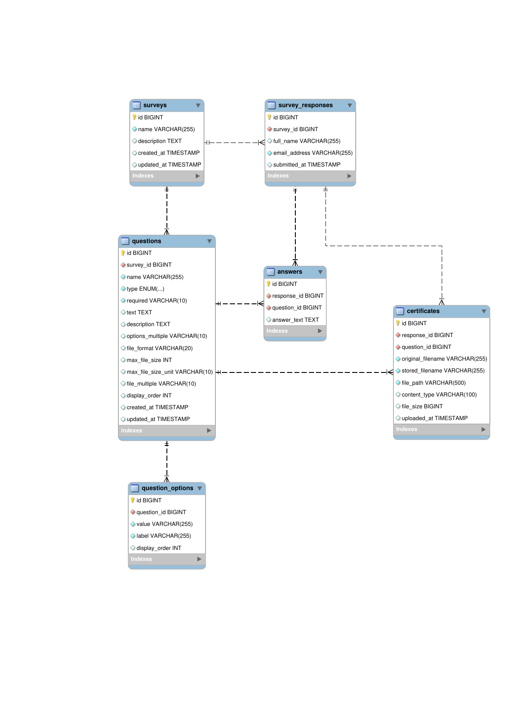

# simple-survey-api

<details>
  <summary> Database ERD</summary>



</details>

<details>
  <summary> Database SQL Script (MySQL)</summary>

## Database SQL Script (MySQL)

```sql
CREATE DATABASE IF NOT EXISTS sky_survey_db;
USE sky_survey_db;

-- ============================
-- SURVEYS
-- ============================
CREATE TABLE IF NOT EXISTS surveys (
                                       id BIGINT AUTO_INCREMENT PRIMARY KEY,
                                       name VARCHAR(255) NOT NULL,
                                       description TEXT,
                                       created_at TIMESTAMP DEFAULT CURRENT_TIMESTAMP,
                                       updated_at TIMESTAMP DEFAULT CURRENT_TIMESTAMP ON UPDATE CURRENT_TIMESTAMP
);

-- ============================
-- QUESTIONS
-- ============================
CREATE TABLE IF NOT EXISTS questions (
                                         id BIGINT AUTO_INCREMENT PRIMARY KEY,
                                         survey_id BIGINT NOT NULL,
                                         name VARCHAR(255) NOT NULL,
                                         type ENUM('short_text', 'long_text', 'email', 'choice', 'file') NOT NULL,
                                         required VARCHAR(10) NOT NULL DEFAULT 'no',
                                         text TEXT,
                                         description TEXT,

    -- choice-question fields
                                         options_multiple VARCHAR(10),

    -- file-question fields
                                         file_format VARCHAR(20),
                                         max_file_size INT,
                                         max_file_size_unit VARCHAR(10),
                                         file_multiple VARCHAR(10),

                                         display_order INT DEFAULT 0,

                                         FOREIGN KEY (survey_id) REFERENCES surveys(id) ON DELETE CASCADE
);

-- ============================
-- QUESTION OPTIONS (for choice questions)
-- ============================
CREATE TABLE IF NOT EXISTS question_options (
                                                id BIGINT AUTO_INCREMENT PRIMARY KEY,
                                                question_id BIGINT NOT NULL,
                                                value VARCHAR(255) NOT NULL,
                                                label VARCHAR(255) NOT NULL,
                                                display_order INT DEFAULT 0,
                                                FOREIGN KEY (question_id) REFERENCES questions(id) ON DELETE CASCADE
);

-- ============================
-- SURVEY RESPONSES (one per submission)
-- ============================
CREATE TABLE IF NOT EXISTS survey_responses (
                                                id BIGINT AUTO_INCREMENT PRIMARY KEY,
                                                survey_id BIGINT NOT NULL,
                                                full_name VARCHAR(255),
                                                email_address VARCHAR(255) NOT NULL,
                                                submitted_at TIMESTAMP DEFAULT CURRENT_TIMESTAMP,
                                                FOREIGN KEY (survey_id) REFERENCES surveys(id) ON DELETE CASCADE,
                                                INDEX idx_survey_email (survey_id, email_address)
);

-- ============================
-- ANSWERS (one per question per response)
-- ============================
CREATE TABLE IF NOT EXISTS answers (
                                       id BIGINT AUTO_INCREMENT PRIMARY KEY,
                                       response_id BIGINT NOT NULL,
                                       question_id BIGINT NOT NULL,
                                       answer_text TEXT,
                                       FOREIGN KEY (response_id) REFERENCES survey_responses(id) ON DELETE CASCADE,
                                       FOREIGN KEY (question_id) REFERENCES questions(id) ON DELETE CASCADE
);

-- ============================
-- CERTIFICATES (file uploads, supports multiple per response)
-- ============================
CREATE TABLE IF NOT EXISTS certificates (
                                            id BIGINT AUTO_INCREMENT PRIMARY KEY,
                                            response_id BIGINT NOT NULL,
                                            question_id BIGINT NOT NULL,
                                            original_filename VARCHAR(255) NOT NULL,
                                            stored_filename VARCHAR(255) NOT NULL,
                                            file_path VARCHAR(500) NOT NULL,
                                            content_type VARCHAR(100),
                                            file_size BIGINT,
                                            uploaded_at TIMESTAMP DEFAULT CURRENT_TIMESTAMP,
                                            FOREIGN KEY (response_id) REFERENCES survey_responses(id) ON DELETE CASCADE,
                                            FOREIGN KEY (question_id) REFERENCES questions(id) ON DELETE CASCADE
);

```

</details>

<details>
  <summary> REST API Documentation</summary>

## REST API Documentation

[Postman Collection](https://web.postman.co/workspace/22be9f29-1235-4fb8-8366-4220bb4b941a/collection/30363029-d456339d-7be1-4711-acd0-9c0b2aa9a5a3?action=share&source=copy-link&creator=30363029)

</details>

<details>
  <summary> REST API Source Code</summary>

## REST API Source Code

- Spring Boot (Java)

- https://start.spring.io/

| Technology       | Version                     |
| ---------------- | --------------------------- |
| Java             | 21                          |
| Spring Boot      | 4.1.0                       |
| Maven            | Latest                      |
| Database         | MySQL                       |
| ORM              | Spring Data JPA + Hibernate |
| Containerization | Docker                      |
| Serialization    | JSON & XML                  |

```bash
simple-survey-api
│
├── Dockerfile                 # Docker image definition
├── HELP.md                    # Spring Boot helper docs
├── mvnw                       # Maven wrapper (Linux/Mac)
├── mvnw.cmd                   # Maven wrapper (Windows)
├── pom.xml                    # Maven dependencies
├── README.md
├── sky_survey_db_erd.png      # Database ERD diagram
│
├── src                        # Spring Boot source code
│
└── uploads                    # Uploaded files storage
```

## 📦 Dependencies

| Dependency                                          | Justification                                                                                                                                | Maven Configuration              |
| --------------------------------------------------- | -------------------------------------------------------------------------------------------------------------------------------------------- | -------------------------------- |
| **Spring Web** _(Web)_                              | Builds RESTful APIs using Spring MVC and includes an embedded Apache Tomcat server, allowing the application to run as a standalone service. | _Included via Spring Initializr_ |
| **Spring Data JPA** _(SQL / Persistence)_           | Simplifies database operations through repository abstractions and integrates with Hibernate for object-relational mapping (ORM).            | _Included via Spring Initializr_ |
| **MySQL Driver** _(SQL / Database)_                 | Provides JDBC connectivity for communicating with the MySQL database.                                                                        | _Included via Spring Initializr_ |
| **Lombok** _(Developer Tools)_                      | Reduces boilerplate code by generating getters, setters, constructors, builders, and other common methods using annotations.                 | _Included via Spring Initializr_ |
| **Validation** _(I/O)_                              | Validates incoming requests using Bean Validation and Hibernate Validator, ensuring data integrity and reducing runtime errors.              | _Included via Spring Initializr_ |
| **Jackson Dataformat XML** _(Serialization)_        | Enables XML serialization and deserialization alongside JSON, allowing the API to support XML payloads when required.                        | Manually Added                   |
| **Dotenv (`springboot4-dotenv`)** _(Configuration)_ | Loads environment variables from a `.env` file, simplifying configuration management across development and production environments.         | Manually Added                   |

## Manually added dependencies (pom.xml)

- Jackson Dataformat XML

```xml
<dependency>
    <groupId>com.fasterxml.jackson.dataformat</groupId>
    <artifactId>jackson-dataformat-xml</artifactId>
</dependency>
```

- Dotenv

```xml
		<dependency>
			<groupId>me.paulschwarz</groupId>
			<artifactId>springboot4-dotenv</artifactId>
			<version>5.1.0</version>
			<scope>compile</scope>
		</dependency>
```

</details>

<details>
  <summary> Miscellaneous </summary>

## Miscellaneous

# Before Deployment Run 
```bash
mvn package -DskipTests  
```
```bash
ls target/*.jar
```

## Docker Setup

```bash
docker build --no-cache -t skyforms-app .
```

## run image

```bash
docker run -d \
  --name skyforms-app-container \
  -p 8080:8080 \
  --env-file .env \
  skyforms-app

```

## Stop & Remove Container

```bash
docker stop skyforms-app-container
```

```bash
docker rm skyforms-app-container
```

## Remove Image

```bash
docker rmi skyforms-app
```

</details>
